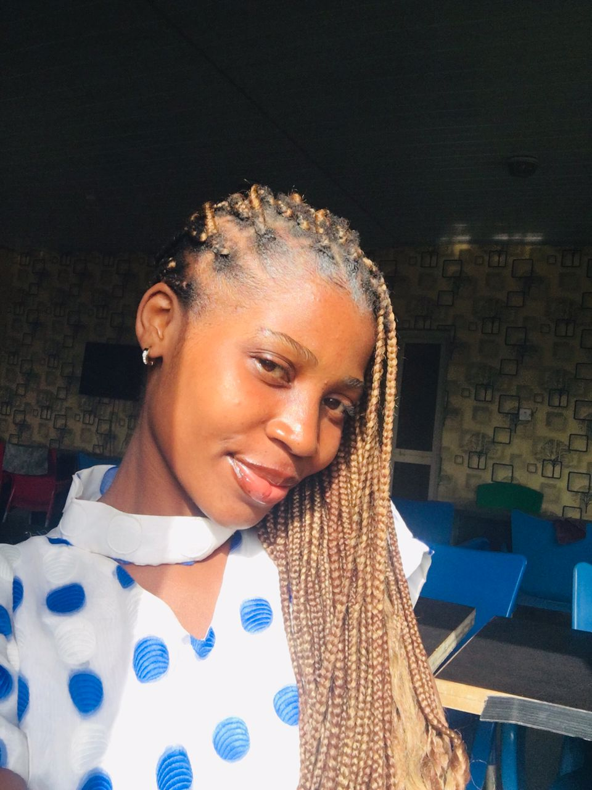

<!-- Profile Banner -->

# Hi, I'm Ohakwe Love

> *"Code is like poetry — and I'm learning to write verses that solve real-world problems."*

I’m a **Full-Stack Web Developer** from Nigeria with a big dream and an even bigger work ethic. I didn't come from a formal tech background, but with consistent effort, a curious mind, and a hunger to create, I've learnt the skills to build web apps that actually **work and wow**.

I’m most inspired by **Mark Zuckerberg**, but how he started small but kept building with vision. I believe in learning fast, starting scrappy, and growing big.

---

### 🔧 Tech Stack & Tools I Use

---

### What I Do
- **Secure Auth Systems** with custom OTP & email verification in Laravel
- **E-commerce Platforms** with cart, wishlist, payment integration
- **Real Estate Platforms** with available listing, payment integrations 
- **Admin Dashboards** for managing users, products, and orders and so much more

---

### A Little More About Me
- I love reading and drawing ideas from books, tech blogs, and real-world stories.
- I believe that **software should be useful first, beautiful second.**
- My mission is to **build products that improve lives**, one line of code at a time.
- I enjoy challenges that make me think deeply — that’s why I’m drawn to full-stack work.

---

### Let's Connect

---

### Quote I Live By
> _"You don’t need to be great to start. But you have to start to be great."_ — Zig Ziglar

---

